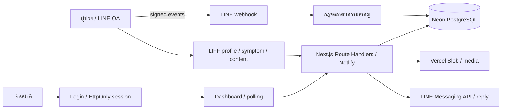

# Ileal Conduit Care

ระบบต้นแบบติดตามผู้ป่วยผ่าน LINE OA / LIFF พร้อมแดชบอร์ดสำหรับพยาบาล

[แดชบอร์ดเจ้าหน้าที่](https://ileal-conduit-dashboard.netlify.app/dashboard)

## Architecture



- Next.js 16 App Router / React 19 / TypeScript / Tailwind CSS / Recharts
- Netlify builds from GitHub `main`; Neon stores patients, messages, issues, assessments, video metadata and content events.
- Media still uses **Vercel Blob** despite the hosting migration. Do not remove its token until storage is separately migrated.
- `lib/server-db.ts` is a PostgreSQL adapter. The legacy `getD1()` name does not mean Cloudflare D1 is used.
- Dashboard APIs check the session cookie before returning patient data.

## User flows

1. ผู้ป่วยเปิด Rich Menu → กรอกประวัติใน LIFF → แจ้งปัญหาและระยะเวลาที่เริ่มพบ
2. เซิร์ฟเวอร์จัดระดับตามกฎใน `lib/triage.ts` → บันทึกเคส → แดชบอร์ดอัปเดตจาก polling
3. พยาบาลเข้าสู่ระบบ → ตรวจเคส → ตอบกลับผ่าน LINE → บันทึกสถานะและเวลาตอบ
4. ผู้ป่วยเปิดคลังวิดีโอ → เลือกดูคลิป → เก็บสถิติการเปิดหน้าและเล่นวิดีโอ

## Local development

ต้องใช้ Node.js >=22.13 และ pnpm

```sh
pnpm install --shamefully-hoist
pnpm dev
```

สำหรับระบบจริง ให้คัดลอก `.env.example` เป็น `.env.local` แล้วกำหนด `DATABASE_URL`, `DASHBOARD_PASSWORD`, `LINE_CHANNEL_ACCESS_TOKEN`, `LINE_CHANNEL_SECRET`, `LIFF_PROFILE_URL`, `LIFF_SYMPTOM_URL`, `PUBLIC_BASE_URL`, `BLOB_READ_WRITE_TOKEN` ตามบริการของคุณ ใช้ `pnpm db:init` กับฐานข้อมูลที่เลือกไว้เท่านั้น ห้าม commit secrets

Webhook: `/api/line/webhook`; LIFF endpoints: `/liff/profile` และ `/liff/symptom` ใช้ URL HTTPS ของ deployment จากนั้นกด Verify ใน LINE Developers Console

## Automated checks

```sh
pnpm test
pnpm typecheck
pnpm build
```

GitHub Actions รัน checks ทุก push/PR โดยไม่ใช้ production secrets

- Triage: urgent keywords, category/onset boundaries, missing fields and intake completion.
- Webhook: HMAC verification, tampered payloads, missing secret, malformed JSON/events, LINE's empty verification event. DB is mocked; tests never contact LINE.
- Authentication: wrong credentials, missing/tampered cookie, unauthenticated dashboard, secure production cookie and fail-closed missing password.

## ขอบเขตของต้นแบบ

กฎ triage เป็น keyword/rule-based และยังไม่ผ่าน clinical validation การทดสอบยืนยันพฤติกรรมโค้ด ไม่ยืนยันความถูกต้องทางการแพทย์ ยังมีข้อจำกัดเรื่องข้อความปฏิเสธ เช่น “ไม่มีไข้” และ webhook redelivery/idempotency ต้องพัฒนาต่อก่อนใช้งานจริงในวงกว้าง

Session ปัจจุบันเป็น deterministic token จากรหัสผ่าน ไม่มี server-side expiry/revocation แม้ cookie มี Max-Age; ควรเปลี่ยนเป็น session ที่หมดอายุจริงและเพิ่ม rate limiting ก่อนขยายผู้ใช้ การตอบกลับและการบันทึก DB ยังไม่เป็น distributed transaction ชุดทดสอบนี้ยังไม่แทน end-to-end บนโทรศัพท์ LINE และการทดสอบส่งข้อความจริง
